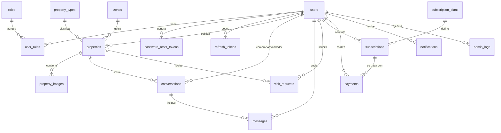

# Base de datos — Plataforma Web Inmobiliaria (MVP DIRECTO)

Esquema PostgreSQL (14+) construido a partir del **Scope técnico — Plataforma Web Inmobiliaria MVP**, sección 16 (Modelo de base de datos sugerido) y las reglas de negocio, estados y módulos del resto del documento.

## Archivos

| Archivo         | Descripción                                                            |
|-----------------|------------------------------------------------------------------------|
| `schema.sql`    | DDL completo: extensiones, tipos ENUM, tablas, constraints, índices y triggers. |
| `seed.sql`      | Datos iniciales: roles, tipos de propiedad, zonas, planes, settings y admin. |
| `.env.example`  | Variables de conexión (incluye `DATABASE_URL` para Prisma/NestJS).     |

## Requisitos

- PostgreSQL **14 o superior**.
- Extensiones (se crean automáticamente en `schema.sql`): `pgcrypto` (UUIDs) y `citext` (emails/keys case-insensitive). Ambas vienen en `contrib` estándar.

## Instalación

```bash
# 1. Crear la base de datos
createdb inmobiliaria

# 2. Crear el esquema (tablas, tipos, índices, triggers)
psql -d inmobiliaria -f schema.sql

# 3. Cargar datos iniciales
psql -d inmobiliaria -f seed.sql
```

> En Windows con Laragon/instalación nativa, usar el `psql.exe` del directorio `bin` de PostgreSQL, p. ej.:
> `& "C:\Program Files\PostgreSQL\16\bin\psql.exe" -U postgres -d inmobiliaria -f schema.sql`

Ambos scripts son transaccionales (`BEGIN/COMMIT`); si algo falla, no se aplica nada parcial. `seed.sql` es **idempotente** (`ON CONFLICT DO NOTHING`), se puede re-ejecutar sin duplicar.

### Cuenta administradora por defecto

| Email                     | Contraseña  |
|---------------------------|-------------|
| `admin@inmobiliaria.com`  | `Admin123!` |

> Contraseña hasheada con **bcrypt (cost 12)**. **Cambiarla antes de producción.**

## Modelo entidad-relación



## Tablas (18)

| Tabla                   | Propósito                                                  | Scope |
|-------------------------|------------------------------------------------------------|-------|
| `users`                 | Cuentas; una sola cuenta con switch comprador/vendedor.    | §3, §4 |
| `roles`                 | Roles RBAC y permisos (JSONB).                             | §3 |
| `user_roles`            | M:N usuarios ↔ roles.                                       | §3 |
| `password_reset_tokens` | Tokens (hash) de recuperación de contraseña.               | §4.1 |
| `refresh_tokens`        | Refresh tokens por sesión/dispositivo.                     | §19 |
| `property_types`        | Catálogo de tipos de propiedad.                            | §13.6 |
| `zones`                 | Zonas/barrios geográficos.                                 | §13.6 |
| `properties`            | Publicaciones, con geolocalización y búsqueda full-text.   | §6, §8 |
| `property_images`       | Galería; una imagen principal por propiedad.               | §6.2 |
| `conversations`         | Hilo de chat comprador-vendedor por propiedad.             | §9 |
| `messages`              | Mensajes del chat, con estado leído/no leído.              | §9 |
| `visit_requests`        | Solicitudes de visita y su estado.                         | §10 |
| `subscription_plans`    | Planes de suscripción y sus límites/beneficios.            | §11 |
| `subscriptions`         | Suscripción de un vendedor a un plan, con vigencia.        | §11 |
| `payments`              | Pagos de suscripciones y comprobantes.                     | §12 |
| `notifications`         | Notificaciones por usuario y canal.                        | §14 |
| `admin_logs`            | Bitácora de acciones administrativas (auditoría).          | §22 |
| `settings`              | Parámetros generales clave/valor (JSONB).                  | §13.6 |

## Decisiones de diseño

- **PK con UUID** (`gen_random_uuid()`): evita enumeración de recursos en endpoints públicos.
- **Estados como ENUM nativos**: un tipo por cada conjunto de estados del documento (usuario, propiedad, aprobación, visita, suscripción, pago, notificación). Más seguro que `varchar` libre y compatible con `enum` de Prisma.
- **`updated_at` automático**: función `set_updated_at()` + trigger `BEFORE UPDATE` en las tablas mutables.
- **Integridad referencial**:
  - `CASCADE` en contenido hijo (imágenes, mensajes, conversaciones, visitas, suscripciones, etc. de un usuario/propiedad).
  - `RESTRICT` en catálogos (`property_types`, `subscription_plans`) para no borrar referencias en uso.
  - `SET NULL` en `payments.subscription_id`, `properties.zone_id` y `admin_logs.admin_id` (se conserva el registro).
- **Reglas de negocio en la base** (§18):
  - Una sola **imagen principal** por propiedad — índice único parcial `WHERE is_main`.
  - Una sola **suscripción activa** por usuario — índice único parcial `WHERE status = 'active'`.
  - `buyer_id <> seller_id` en chats y visitas.
  - `CHECK` de rangos en precio, lat/long, superficie, habitaciones, fechas de suscripción.
- **Búsqueda y mapa** (§5, §7):
  - Columna generada `search_vector` (`tsvector` en español) + índice **GIN** para búsqueda de texto.
  - Índice compuesto `(latitude, longitude)` para consultas por *bounding box* en el mapa.
  - Índices sobre los filtros del MVP: precio, tipo, zona, habitaciones, operación, estado.
- **Auditoría y seguridad**: `admin_logs`, tokens hasheados (nunca en claro), `INET` para IPs.

## Mapa MVP → sección del scope

Cubre el modelo de la **§16** completo y añade lo que las reglas implican: `user_roles`, `password_reset_tokens` y `refresh_tokens` (§4.1, §19), campos `operation`, `is_featured`, `rejection_reason`, `views_count` en `properties` (§7, §13.3, §11), y beneficios por plan en `subscription_plans` (§11.1).

## Siguiente paso sugerido

El stack recomendado (§15.3) usa **NestJS + Prisma**. Si quieres, puedo generar el `schema.prisma` equivalente (con los mismos enums y relaciones) para conectar el backend directamente. La introspección de Prisma sobre esta base (`prisma db pull`) también funciona.
